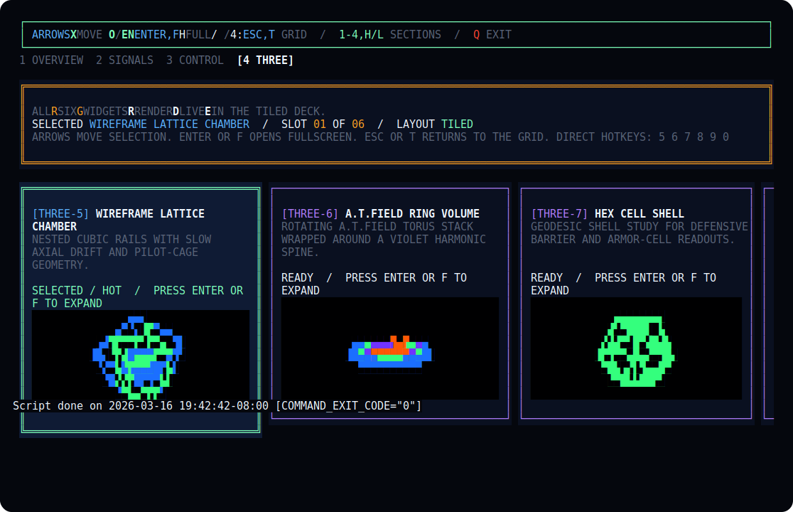

# Neon Exodus

Neon Exodus is a paired UI showcase built from the analyzed reference set in [`plan.md`](plan.md). It ships the same interface language in two forms:

- [`webtui-neon-exodus/`](webtui-neon-exodus/) for the browser with Vite, React, and themed Three.js canvases
- [`opentui-neon-exodus/`](opentui-neon-exodus/) for the terminal with OpenTUI and the `@opentui/core/3d` renderer

Both apps expose the same widget families: warning overlays, counters, pilot/profile panels, live-feed corruption, event logs, channel matrices, meter walls, waveform strips, harmonic graphs, psychographs, circular capture fields, hex heatmaps, tactical maps, MAGI boards, route/gate controls, network topology, and the full six-widget 3D suite.

## Screenshots




## Demo Videos

### webTUI

<video src="webtui.mp4" controls muted loop playsinline></video>

[Direct video link](webtui.mp4)

### OpenTUI

<video src="openTUI.mp4" controls muted loop playsinline></video>

[Direct video link](openTUI.mp4)

## Project Layout

- [`plan.md`](plan.md): interface analysis and implementation plan
- [`webtui-neon-exodus/`](webtui-neon-exodus/): browser showcase app
- [`opentui-neon-exodus/`](opentui-neon-exodus/): terminal showcase app
- [`docs/`](docs/): static build output for GitHub Pages
- [`screenshots/`](screenshots/): captured screenshots used in this README
- [`webtui.mp4`](webtui.mp4): browser showcase capture
- [`openTUI.mp4`](openTUI.mp4): terminal showcase capture

## Running

```bash
cd webtui-neon-exodus
npm install
npm run dev
```

```bash
cd opentui-neon-exodus
bun install
bun run start
```

OpenTUI controls:

- `1-5` or `h` / `l` switch sections, including the full `All` wall
- Arrow keys move selection through the visible demo grid
- Mouse hover selects widgets, and double-click or right-click maximizes them
- `Enter` or `f` opens the selected widget fullscreen with audio
- `Esc` or `t` returns to the tiled view
- `+` / `-` adjust volume
- `q` exits

## Building

```bash
cd webtui-neon-exodus
npm run build
```

```bash
cd opentui-neon-exodus
bun run typecheck
```

The web app is configured for GitHub Pages. Its Vite build uses relative asset paths and writes the generated site into [`docs/`](docs/), so it works from a repository subdirectory on a shared domain.
